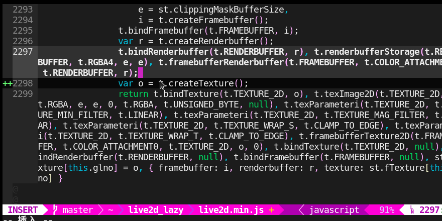
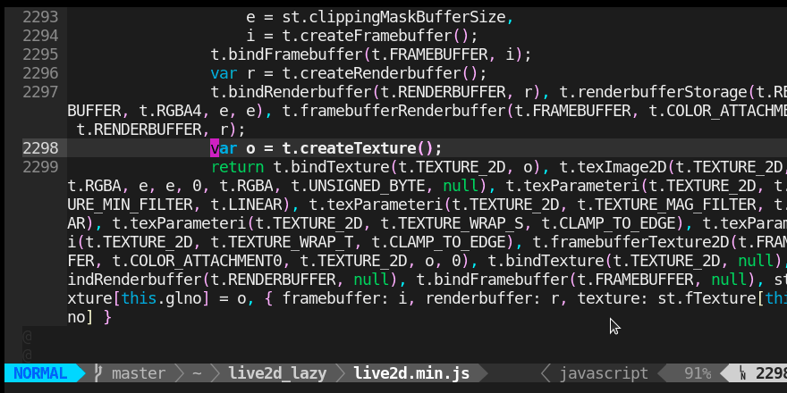

## `vim-sb-complete2`

the most lightweight(SHA BI) completion plug of vim

## Description

1. the function is the same as [vim-sb-complete1](https://github.com/NiaBie/vim-sb-complete1)

2. much faster than `vim-sb-complete1`

3. but not support for CJK

- comparie with `vim-sb-complete1`

    1. `vim-sb-complete1`

    

    2. `vim-sb-complete2`

    

## Installation

- manual
    - put the `autoload/sbcom2.vim` to `~/.vim/autoload/`
    - put the `plugin/sbcom2.vim` to `~/.vim/plugin/`

- `vim-plug`
    - add `Plug 'niabie/vim-sb-complete2'` to your `~/.vimrc`
        - execute `:PlugInstall` in vim

## Usage

1. add this to `~/.vimrc`, to start-up the plug

```vim
let g:sbcom2_active = 1
```

2. manual turning off or on
    - turn off `:Sbcom2Off`
    - turn on `:Sbcom2On`

3. The default trigger is `<tab>`. If you want to change the trigger, for example, replace `<tab>` with `<space>`, add this to your `~/.vimrc`

```vim
let g:sbcom2_trigger = "<space>"
```

another example, using a sequence `jkl` to replace `<tab>`

```vim
let g:sbcom2_trigger = "jkl"
```

3. Set the searching field. The script will search the words which are in the nearest `g:sbcom2_maxline` lines (default is 60)

```vim
let g:sbcom2_maxline = 30
```

Don't use this command in commandline directly

## Uninstallation

- manual
    - delete `autoload/sbcom2.vim`
    - delete `plugin/sbcom2.vim`

- `vim-plug`
    -  ~~`Plug 'niabie/vim-sb-complete2'`~~
        - execute `:PlugClean` in vim

## TODO

- The script is too slow
